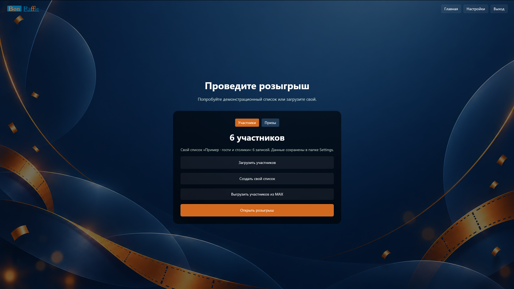
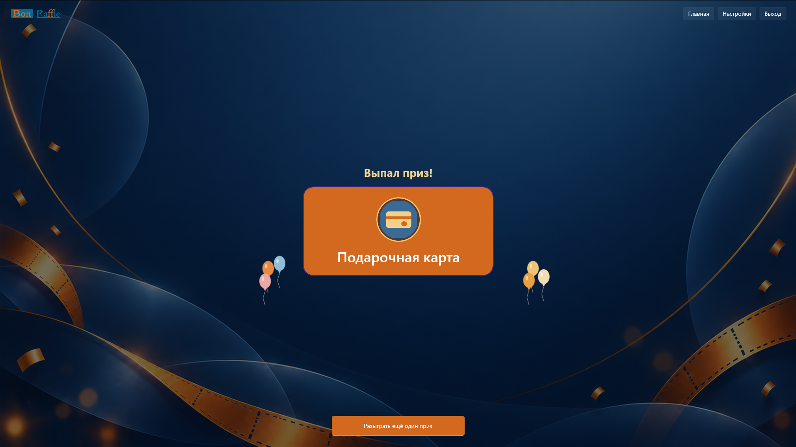
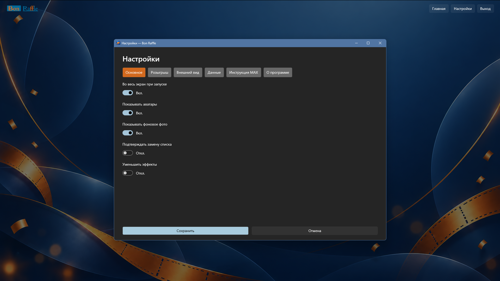
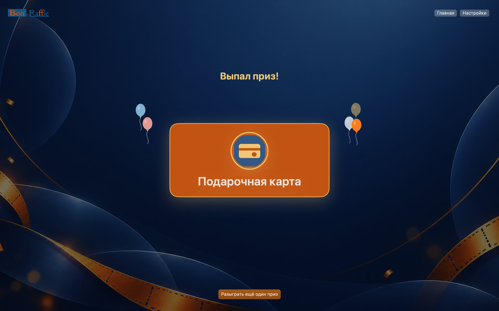
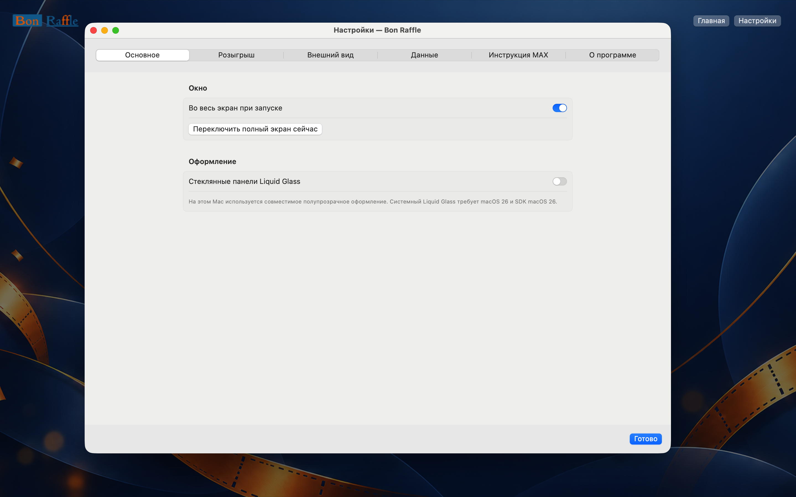

# Bon Raffle

Нативное приложение для розыгрышей на **Windows** и **macOS**. Подходит ведущим мероприятий, организаторам конкурсов и администраторам сообществ MAX. Проводите розыгрыш среди людей, столиков и других записей или разыгрывайте призы с заданным количеством и относительным шансом. Списки можно создать прямо в приложении, загрузить из CSV или выгрузить из канала MAX через бота.

*Bon Raffle is a native raffle app for Windows and macOS with participant lists, weighted prizes and MAX roster export.*

## Как выглядит

Снимки Windows и macOS показывают демонстрационные и вымышленные тестовые данные. Интерфейс macOS реализован отдельно на SwiftUI.

### Windows: участники

### Windows: результат розыгрыша приза

### Windows: основные настройки

### Windows: настройки оформления

### macOS: участники

### macOS: результат розыгрыша приза

### macOS: основные настройки

### macOS: настройки оформления

## Возможности

- **Участники.** Импорт CSV, собственные именованные списки и картинки записей. Победитель исключается из следующих выборов текущего списка.
- **Призы.** Отдельные наборы призов с изображениями, остатком и весом шанса. После выигрыша остаток уменьшается; его можно пополнить в редакторе.
- **Быстрый старт.** Четыре удаляемых примера: люди, столики, подарки и предметы для дома. Изображения примеров входят в приложение.
- **MAX.** Бот-администратор выгружает участников канала или группы в CSV. Затем файл загружается обычной кнопкой импорта. Адрес API MAX можно изменить в настройках.
- **Оформление.** Фон, логотип, запасная картинка участника, цвета, рамка победителя, подписи и видимость числа над барабаном настраиваются. Таймер начала розыгрыша с кольцом находится над барабаном и по умолчанию выключен.
- **Локальные данные.** Приложение сохраняет списки, настройки и историю победителей на устройстве. Токен бота хранится в Windows Credential Manager или macOS Keychain.

## Настройте розыгрыш под себя

- **Для события и аудитории:** создавайте списки людей, столиков или любых других записей; добавляйте свои изображения участникам и призам, переключайтесь между наборами.
- **Для экрана и трансляции:** выберите фон и логотип, настройте затемнение фона, прозрачность карточки и барабана, цвета кнопок, выбранной строки, карточки победителя и её рамки. Можно заменить картинку участника без фото.
- **Для хода розыгрыша:** задайте длительность и скорость вращения, частоту анимации и эффект победы. При необходимости скройте число участников над барабаном.
- **Для своих объявлений:** измените подписи над барабаном отдельно для участников и призов. Включите таймер начала, задайте минуты, текст над ним и цвет кольца. Подписи ограничены 200 символами.
- **Для удобства ведущего:** доступны запуск во весь экран, показ аватаров и фонового фото, подтверждение замены списка и уменьшение эффектов.

## Установка и запуск

### Windows

Нужна Windows 10 (сборка 17763 или новее) либо Windows 11, архитектура x64. Откройте [выпуски Bon Raffle](https://github.com/bonappetitabc/BonRaffle/releases) и выберите последнюю версию для Windows с установщиком `.exe`. В конце установки можно выбрать запуск приложения.

### macOS

Нужна macOS 15 или новее. Откройте [выпуски Bon Raffle](https://github.com/bonappetitabc/BonRaffle/releases) и выберите последнюю версию для macOS с образом `.dmg`. Откройте образ и перетащите приложение в «Программы».

## Быстрый сценарий

1. Откройте режим «Участники» или «Призы» на главной.
2. Выберите один из демонстрационных списков, создайте свой или загрузите CSV участников.
3. Для призов укажите количество и вес шанса. Вес определяет относительную вероятность среди доступных призов; исчерпанные призы больше не выпадают.
4. Откройте розыгрыш и нажмите кнопку выбора. Историю победителей можно просмотреть в приложении.

### Участники из MAX

Создайте бота MAX для бизнеса, назначьте его администратором канала или группы и получите `chat_id` через события MAX. В разделе **Настройки → Данные** введите `chat_id` и токен бота. На главной нажмите **«Выгрузить участников из MAX»**: CSV появится в «Загрузках». Загрузите его кнопкой импорта участников. Пошаговая помощь есть в приложении во вкладке «Инструкция MAX».

При поиске победителя в MAX ориентируйтесь на позицию его строки в выгруженном списке, имя, аватар и соседние записи. Внутренний ID MAX не является способом поиска участника в интерфейсе мессенджера.

## Хранение данных и безопасность

Списки и настройки хранятся на устройстве. Токен MAX сохраняется в защищённом хранилище Windows или macOS, а CSV-выгрузка MAX - в «Загрузках».

## Лицензия

[MIT](LICENSE). © 2026 bonappetit.abc.
