

  

Приложение для розыгрышей на **Windows** и **macOS**. Подходит ведущим мероприятий, организаторам конкурсов и администраторам сообществ мессенджера MAX. Проводите розыгрыш среди людей, столиков и других записей или разыгрывайте призы с заданным количеством и относительным шансом. Списки можно создать прямо в приложении, загрузить из CSV или выгрузить из канала MAX через бота.

*Bon Raffle is a raffle app for Windows and macOS with participant lists, weighted prizes and messenger MAX roster export.*

## Как выглядит

Снимки Windows и macOS показывают демонстрационные и вымышленные тестовые данные.

Скриншоты Windows

**Таймер на главной**

**Отсчёт перед розыгрышем**

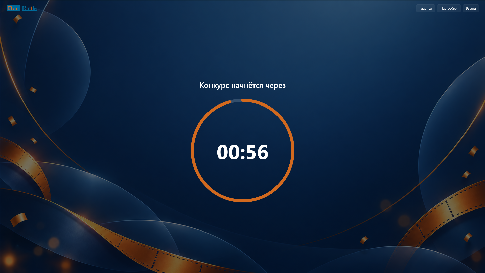

**Пауза при наведении на таймер**

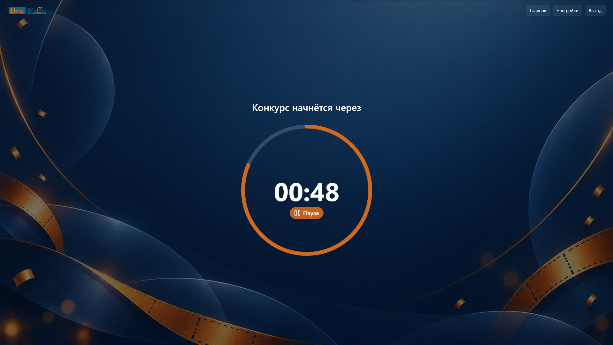

**Загрузка участников из MAX**

**Списки участников**

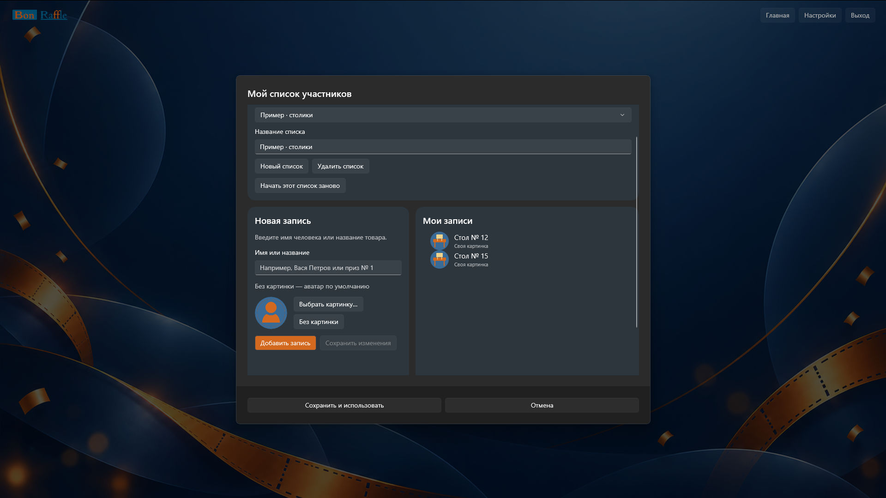

**Режим призов**

**Списки призов**

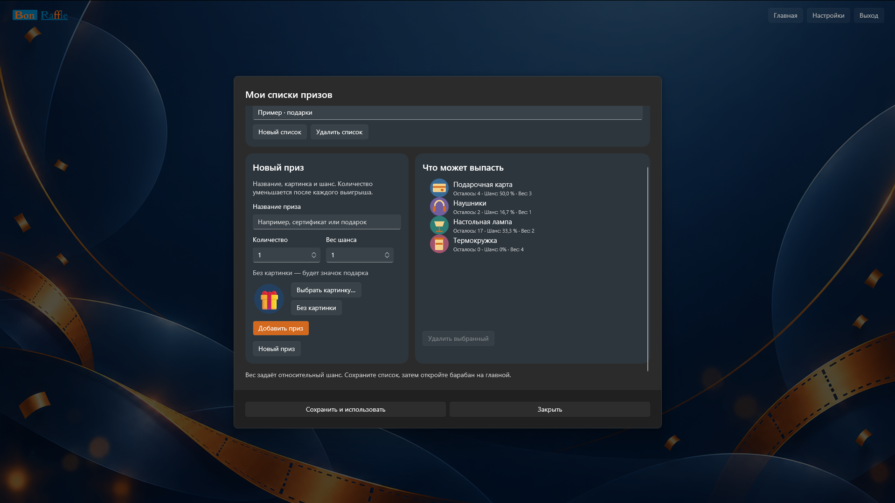

**Барабан участников**

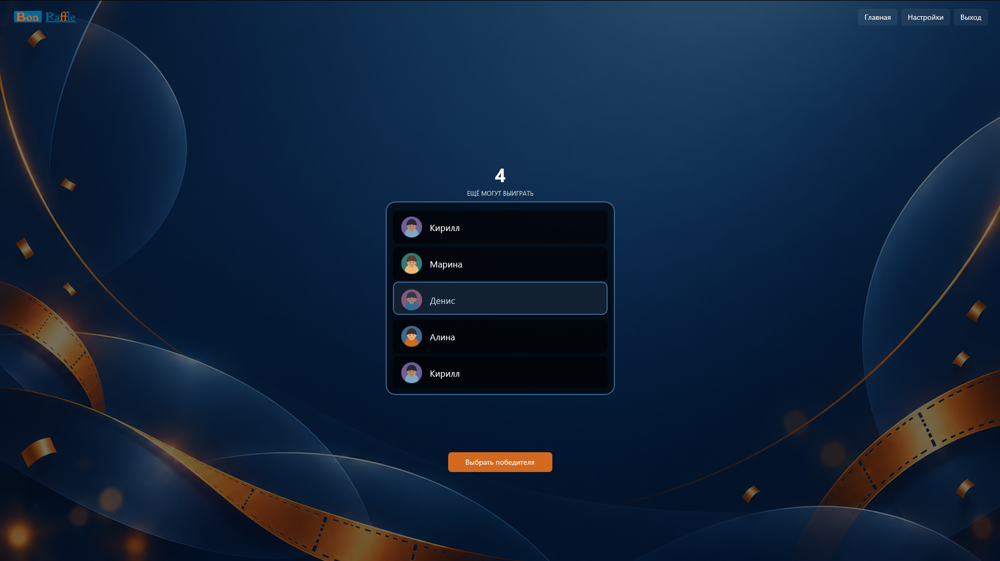

**Настройки розыгрыша**

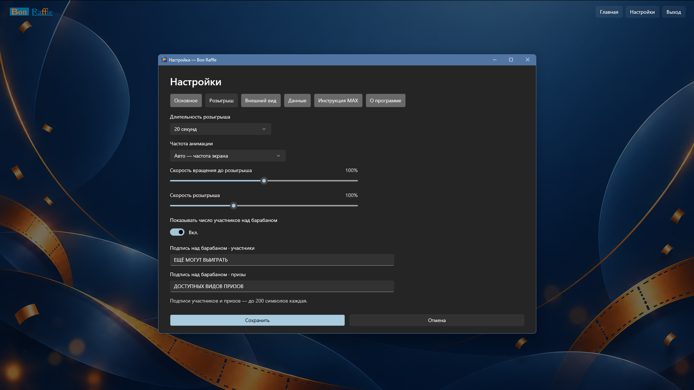

**Настройки оформления**

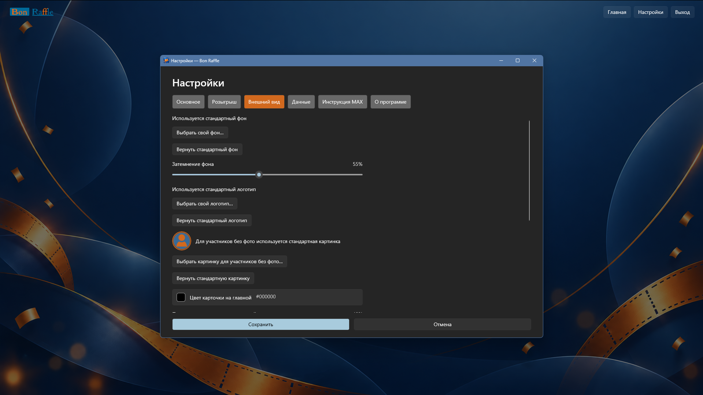

Скриншоты macOS

**Режим участников**

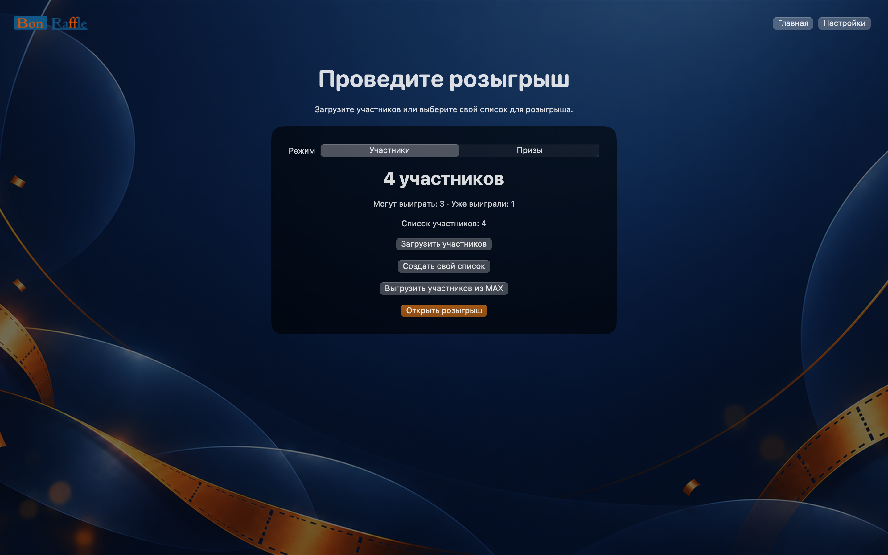

**Таймер на главной**

**Отсчёт перед розыгрышем**

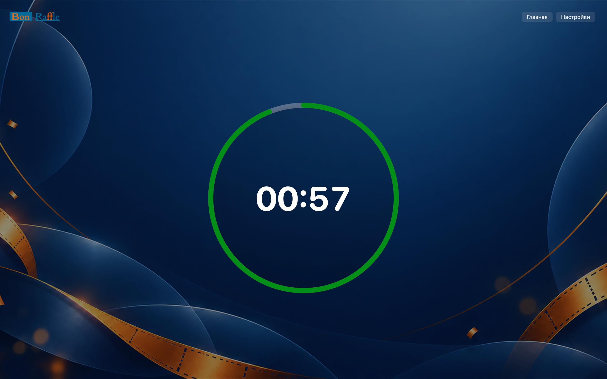

**Пауза при наведении на таймер**

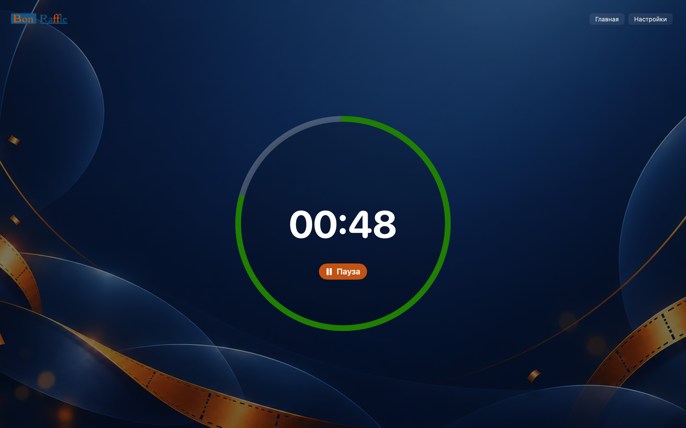

**Загрузка участников из MAX**

**Списки участников**

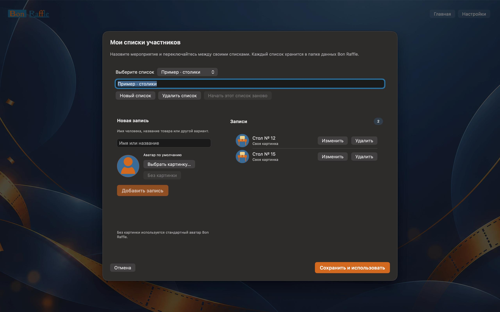

**Режим призов**

**Списки призов**

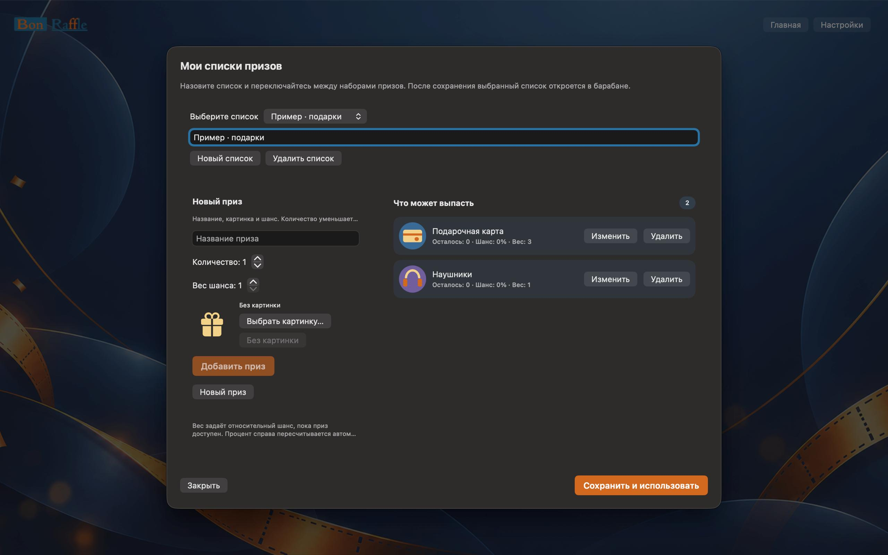

**Барабан участников**

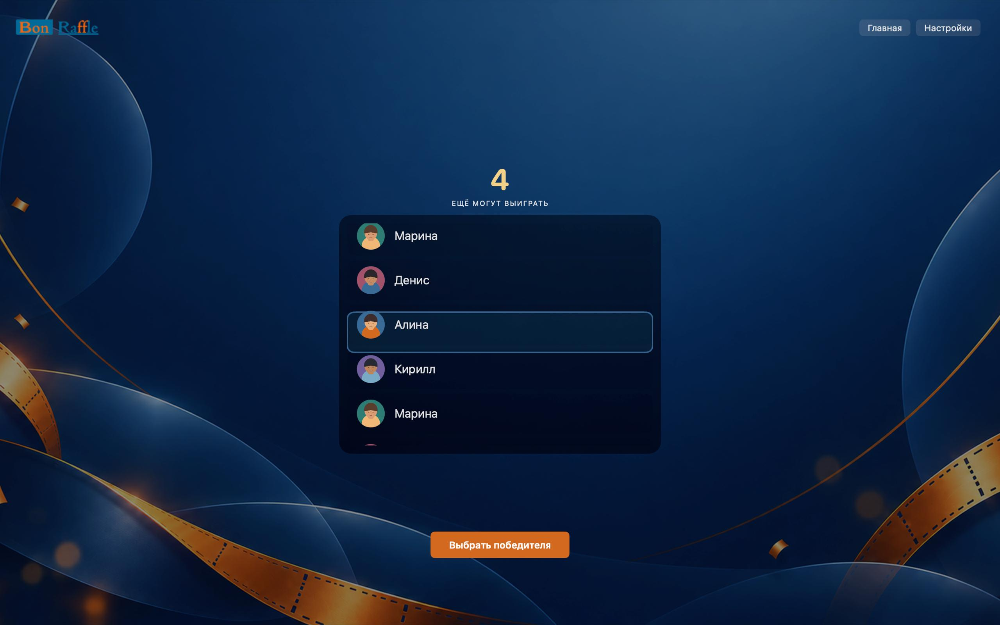

**Настройки розыгрыша**

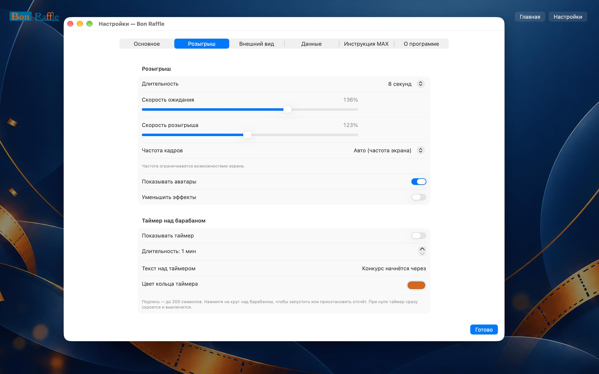

**Настройки оформления**

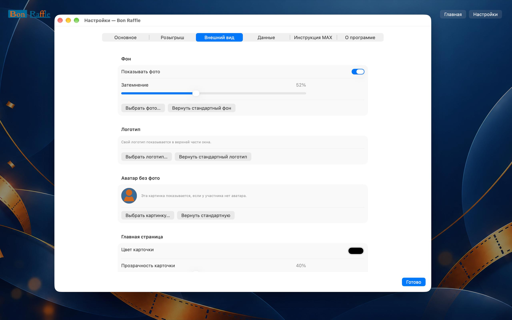

## Возможности

- **Участники.** Импорт CSV, собственные именованные списки и картинки записей. Победитель исключается из следующих выборов текущего списка.
- **Призы.** Отдельные наборы призов с изображениями, остатком и весом шанса. После выигрыша остаток уменьшается его можно пополнить в редакторе.
- **Быстрый старт.** Четыре удаляемых примера: люди, столики, подарки и предметы для дома. Изображения примеров входят в приложение.
- **MAX.** Бот-администратор выгружает участников канала или группы в CSV. Затем файл загружается обычной кнопкой импорта. Адрес API MAX можно изменить в настройках.
- **Оформление.** Фон, логотип, запасная картинка участника, цвета, рамка победителя, подписи и видимость числа над барабаном настраиваются. Большой таймер запускается с главной перед розыгрышем по завершении открывается барабан. Таймер по умолчанию выключен.
- **Локальные данные.** Приложение сохраняет списки, настройки и историю победителей на устройстве. Токен бота хранится в Windows Credential Manager или macOS Keychain.
- **Обновления.** Начиная с версии 2.3.3 приложение проверяет общий выпуск Bon Raffle на GitHub при запуске, не чаще раза в сутки. Ручная проверка доступна в «Настройки → О программе». Системные уведомления включаются отдельно.

## Настройте розыгрыш под себя

- **Для события и аудитории:** создавайте списки людей, столиков или любых других записей добавляйте свои изображения участникам и призам, переключайтесь между наборами.
- **Для экрана и трансляции:** выберите фон и логотип, настройте затемнение фона, прозрачность карточки и барабана, цвета кнопок, выбранной строки, карточки победителя и её рамки. Можно заменить картинку участника без фото.
- **Для хода розыгрыша:** задайте длительность и скорость вращения, частоту анимации и эффект победы.
- **Для своих объявлений:** измените подписи над барабаном отдельно для участников и призов. Включите таймер на главной, задайте минуты и секунды, а текст над ним и цвет кольца - в настройках. Подписи ограничены 200 символами.
- **Для удобства ведущего:** доступны запуск во весь экран, показ аватаров и фонового фото, подтверждение замены списка и уменьшение эффектов.

## Установка и запуск

### Windows

Нужна Windows 10 (сборка 17763 или новее) либо Windows 11, архитектура x64. Откройте [последний выпуск Bon Raffle](https://github.com/bonappetitabc/BonRaffle/releases/latest) и скачайте установщик `.exe`. В конце установки можно выбрать запуск приложения.

### macOS

Нужна macOS 15 или новее. Откройте [последний выпуск Bon Raffle](https://github.com/bonappetitabc/BonRaffle/releases/latest) и скачайте образ `.dmg`. Откройте образ и перетащите приложение в «Программы».

### Обновления

При появлении плашки новой версии нажмите **«Посмотреть»** или откройте **«Настройки → О программе»**. Посмотрите описание изменений и скачайте обновление.

- **Windows:** нажмите **«Закрыть Bon Raffle и запустить установщик»**. Windows может запросить разрешение на установку.
- **macOS:** нажмите **«Открыть DMG»**, закройте Bon Raffle и перетащите новую версию в «Программы», подтвердив замену.

Списки и настройки сохраняются отдельно от файлов приложения. Проверка и уведомления выполняются, пока Bon Raffle запущен.

## Быстрый сценарий

1. Откройте режим «Участники» или «Призы» на главной.
2. Выберите один из демонстрационных списков, создайте свой или загрузите CSV участников.
3. Для призов укажите количество и вес шанса. Вес определяет относительную вероятность среди доступных призов; исчерпанные призы больше не выпадают.
4. Откройте розыгрыш и нажмите кнопку выбора. Историю победителей можно просмотреть в приложении.

### Участники из MAX

Создайте бота MAX для бизнеса, назначьте его администратором канала или группы и получите `chat_id` через события MAX. В разделе **Настройки → Данные** введите `chat_id` и токен бота. На главной нажмите **«Выгрузить участников из MAX»** CSV появится в «Загрузках». Загрузите его кнопкой импорта участников. Пошаговая помощь есть в приложении во вкладке «Инструкция MAX».

При поиске победителя в MAX ориентируйтесь на позицию его строки в выгруженном списке, имя, аватар и соседние записи. Внутренний ID MAX не является способом поиска участника в интерфейсе мессенджера.

## Хранение данных и безопасность

Списки и настройки хранятся на устройстве. Токен MAX сохраняется в защищённом хранилище Windows Credential Manager или macOS Keychain, а CSV-выгрузка MAX - в «Загрузках».

## Исходный код

- [Windows](https://github.com/bonappetitabc/BonRaffle/tree/main/Bon%20Raffle/bonraffle_winui) — C# и WinUI 3.
- [macOS](https://github.com/bonappetitabc/BonRaffle/tree/main/Bon%20Raffle/bonraffle_macos) — Swift и SwiftUI.

Готовые `.exe` и `.dmg` доступны в [выпусках](https://github.com/bonappetitabc/BonRaffle/releases).

## Лицензия

[MIT](LICENSE). © 2026 Bon Raffle.
